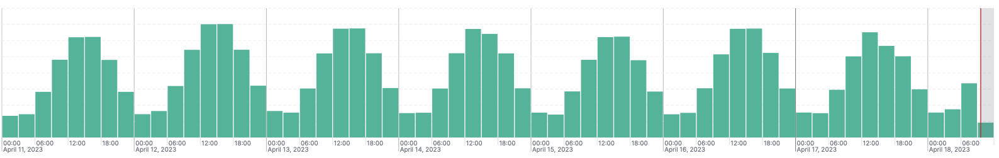
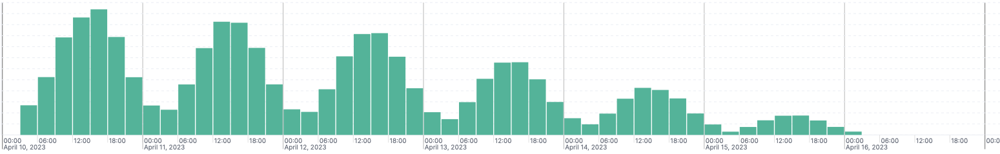

## Solution

* Add Daily and Weekly Traffic Distribution using random.nextGaussian
* Use Index LifeCycle Management Policy for Rolling Over Index and Moving to Cold Phase for retention
* Use Transforms to get aggregated information of Daily Data.
* REST API in /elastic_api/console_api.md

## Simulated payments data monitoring in Elastic

The responsibility of Boku as a payment processor is to monitor all transactions made between different merchants and payment providers in order to detect outages there as quickly as possible. Outages may happen both on the payment provider side (resulting as increase in failed transactions) or on the merchant side (resulting in reduced amount of incoming traffic).  

However, understanding “when there is less traffic than normal” is a complex problem and might need testing of different monitoring / alerting solutions.   

Your task is to simulate different traffic patterns with log generation and build pipeline in Elastic to accept those logs: 

* Modify the source code to have example data generated for different traffic patterns: daily cycle and/or weekly cycle. 
* Build a pipeline for log index rotation and retention in Elastic, configuration is up to you. 
* Create a solution to store compacted information about quantity of logs preserving status and qualifier per 1 day, use any of the means elastic provides: transforms, rollup jobs, downsampling. 
* Provide the modified application source code. 
* For all created resources in Elastic provide REST requests or their configuration JSON. We should be able to easily replicate your setup using them. 
* Be ready to describe your ideas on how to implement more advanced test data generators and outage detection (no need to present in written form).  

This repository contains: 

* Basic code to send synthetic traffic to Elastic 
* Elastic & Kibana docker configuration with instructions 

Traffic pattern examples:

* Daily cycle traffic

* Weekly cycle traffic

